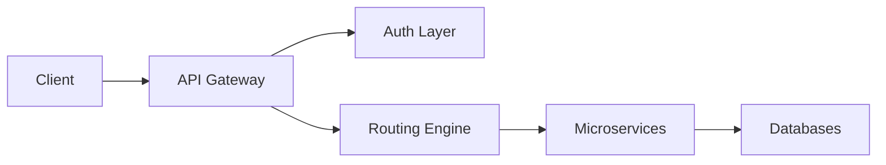

## Introduction

As applications grow beyond a single codebase and evolve into distributed systems, one challenge quickly becomes obvious — communication between services starts to become chaotic. Clients need to know multiple endpoints, security logic gets duplicated across services, deployments become risky, and monitoring turns fragmented.

I encountered this exact problem while designing scalable backend systems and microservices platforms. Initially, direct service communication worked. But once traffic increased and new services were introduced, maintaining consistency became extremely difficult.

That is where the **API Gateway** becomes not just useful, but essential.

In this article, I’ll break down how enterprise API Gateway architecture works in real production environments, why it exists, how to design one properly, and the engineering principles that separate a simple proxy server from a true production-grade gateway.

---

## The Real Problem Behind Modern Microservices

When a system starts small, direct API calls between services seem simple. A frontend calls the auth service, product service, and order service independently. Everything works — until it doesn’t.

As systems grow:

- Clients become tightly coupled to backend services
- Security rules must be replicated everywhere
- Rate limiting becomes inconsistent
- Logging becomes scattered
- API versions start breaking integrations

Developers spend more time managing infrastructure complexity than building features.

An API Gateway introduces a single, intelligent entry point that manages this complexity centrally.

---

## What an Enterprise API Gateway Actually Does

Many developers assume an API Gateway is just a reverse proxy. In reality, it becomes a central nervous system for backend communication.

### Unified Entry Point

Instead of exposing multiple services publicly, the gateway becomes the only public-facing layer. Clients send requests to one domain, while the gateway routes internally.

This reduces client complexity and hides internal infrastructure.

### Centralized Authentication

One of the biggest benefits is moving authentication logic out of individual services. The gateway validates JWT tokens, checks permissions, and ensures that only authorized requests reach backend services.

This creates a consistent security model across the entire system.

### Traffic Control and Stability

Enterprise gateways manage system resilience through:

- Rate limiting
- Request throttling
- Retry logic
- Circuit breaking

Without these controls, a single failing service can cascade into a full system outage.

### Observability and Monitoring

A gateway sees every request entering the system. That makes it a powerful place to implement:

- Request logging
- Latency tracking
- Error monitoring
- Distributed tracing

This centralized visibility is critical for debugging production issues quickly.

---

## High-Level Enterprise Gateway Architecture

In a real-world production environment, the gateway sits between external clients and internal microservices.



The gateway remains stateless and horizontally scalable, ensuring it never becomes a bottleneck.

---

## Designing a Production-Ready Gateway

### Start with Clean Routing Rules

Clear routing rules prevent architectural confusion later. Each service should own a specific route namespace.

Examples:

- `/api/auth` → authentication service
- `/api/products` → catalog service
- `/api/orders` → order processing

Consistent routing makes versioning and scaling far easier.

### Middleware is the Real Power Layer

Production gateways rely heavily on middleware pipelines.

Common layers include:

- Authentication validation
- Request logging
- Rate limiting
- Input sanitization
- Compression
- Security headers

By keeping middleware modular, the gateway remains flexible as the system grows.

### Example Implementation (Node.js Gateway)

```javascript
const express = require("express");
const proxy = require("express-http-proxy");
const jwt = require("jsonwebtoken");

const app = express();

app.use((req, res, next) => {
  const token = req.headers.authorization;
  if (token) {
    jwt.verify(token, process.env.JWT_SECRET);
  }
  next();
});

app.use("/auth", proxy("http://auth-service:8001"));
app.use("/products", proxy("http://product-service:8002"));
app.use("/orders", proxy("http://order-service:8003"));

app.listen(8000, () => {
  console.log("API Gateway running on port 8000");
});
```

This example is simplified, but the architectural principles remain the same in enterprise systems.

---

## Advanced Enterprise Capabilities

### Request Aggregation

Instead of multiple client requests, the gateway can fetch data from several services and return a single combined response. This reduces network overhead and improves frontend performance.

### Circuit Breaker Strategy

When a service starts failing, the gateway temporarily stops sending traffic to it. This prevents system-wide cascading failures and allows degraded but functional operation.

### Intelligent Rate Limiting

Enterprise systems implement layered throttling strategies:

- Per user
- Per API key
- Per IP address
- Per endpoint

This protects infrastructure from abuse and unexpected traffic spikes.

---

## Performance Optimization in Production

Large-scale systems require performance-focused gateway design.

Key optimizations include:

- Response caching for frequently requested endpoints
- Gzip or Brotli compression
- Keep-alive HTTP connections
- Non-blocking asynchronous request handling
- Optimized routing tables

These improvements significantly reduce latency and infrastructure costs.

---

## Security Principles Every Gateway Must Follow

Enterprise gateways must assume a zero-trust environment.

Core practices include:

- Token validation at gateway level
- HTTPS enforcement
- Input sanitization
- API key validation
- IP filtering
- Secure header enforcement

For highly sensitive systems, additional enhancements like mutual TLS and service mesh integration may be used.

---

## Deployment Strategy for Enterprise Systems

The gateway should always be deployed in a scalable and redundant configuration.

Typical production setup includes:

- Containerized deployment using Docker
- Kubernetes orchestration
- Horizontal scaling
- Health checks and automatic failover
- Canary deployments for safe rollouts

This ensures high availability even during peak traffic or partial system failures.

---

## Common Engineering Mistakes I’ve Seen

- Adding business logic inside the gateway
- Making the gateway stateful
- Ignoring rate limiting early
- Poor API versioning strategy
- Missing centralized logging
- Hardcoding service endpoints instead of service discovery

Avoiding these mistakes early saves massive refactoring later.
