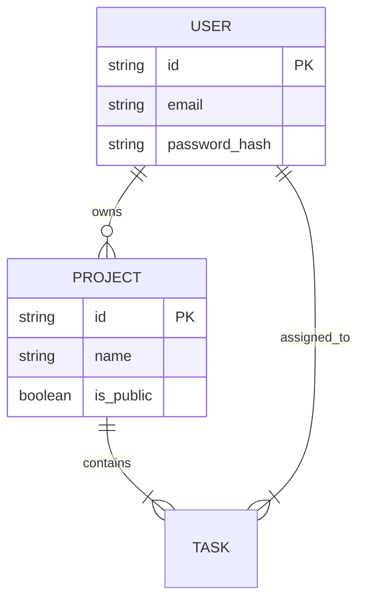

## Why Most SaaS Products Fail

They fail not because of bad code, but because of **ambiguous requirements**.
A Product Requirements Document (PRD) is the contract between the Product Manager/Founder and the Engineering Team. It removes assumptions.

---

## The PRD Structure

### 1. Executive Summary
**Goal**: What are we building and why?
*Example*: "A collaborative whiteboard tool for remote teams that integrates directly with Slack."
**Success Metrics**: "Acquire 1,000 DAU by Q3."

### 2. User Personas
Define exactly who you are solving for.
*   **The Power User (Admin)**: Wants keyboard shortcuts, integrations, billing controls.
*   **The Casual User**: Wants zero friction, simple guest access.

---

### 3. Functional Requirements (The Meat)

This section maps out every feature.

#### Feature: User Authentication
*   **Priority**: P0 (Blocker)
*   **Description**: Users must be able to sign up via Email or Google.
*   **Acceptance Criteria**:
    *   [ ] User enters email/password.
    *   [ ] System checks if email exists.
    *   [ ] System hashes password (bcrypt).
    *   [ ] User receives JWT on success.
    *   [ ] "Forgot Password" flow triggers email with temporary token.

#### Feature: Real-time Collaboration
*   **Priority**: P1
*   **Tech Constraint**: Must use WebSockets (Socket.io). Latency < 50ms.

---

### 4. Database Schema (Draft)

Engineers need to know the data relationships early.

---

### 5. UI/UX Flows (Wireframes)

Don't just write text. Show flowcharts.

*   **Happy Path**: Login -> Dashboard -> New Project -> Invite Member.
*   **Edge Case**: Login -> Subscription Expired -> Payment Page.

---

### 6. Technical Constraints & Non-Functional Requirements

*   **Performance**: Dashboard must load in < 1.0s (LCP).
*   **Security**: All PII must be encrypted at rest.
*   **Compliance**: GDPR compliant (data export and deletion available).

---

## Implementation Checklist

1.  **Draft Review**: Engineering Lead reviews feasibility.
2.  **Design Handoff**: Figma files attached to tickets.
3.  **Sprint Planning**: Break PRD into Jira/Linear tickets.
4.  **UAT (User Acceptance Testing)**: PM verifies against PRD before launch.

A great PRD changes over time, but it starts as the bedrock of your product.
