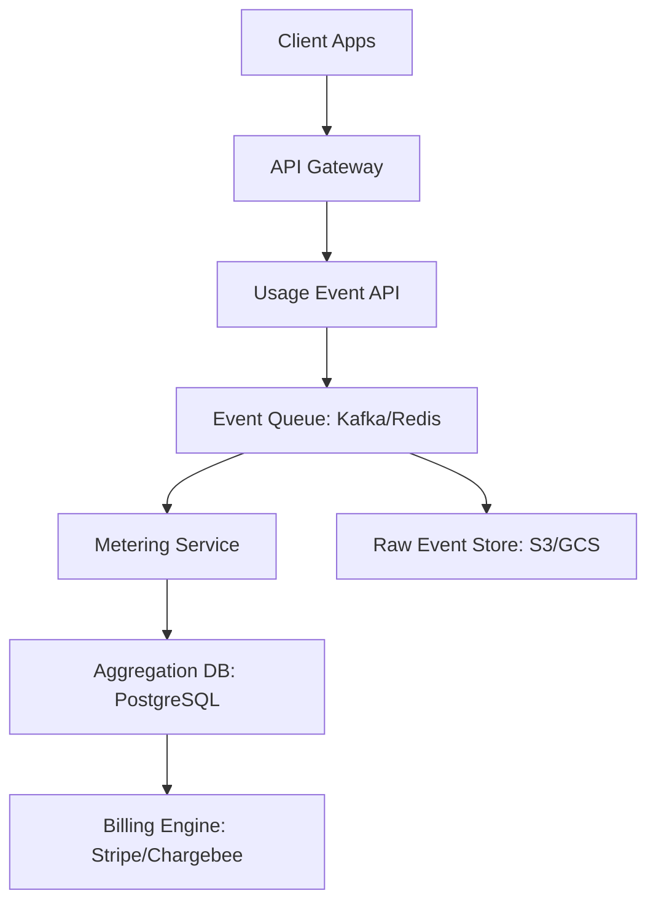

# Usage-Based Pricing Architecture in SaaS
### Designing Accurate, Scalable, Fault-Tolerant Metering Systems

Usage-Based Pricing (UBP) enables SaaS platforms to bill customers based on actual consumption — API calls, compute time, storage usage, etc.

However, metering is fundamentally a distributed systems and financial accounting problem. A production-grade usage-based pricing system must guarantee:

- **Accuracy**: Every billable unit must be accounted for.
- **Idempotency**: Processing the same event twice should not lead to double billing.
- **Auditability**: You must be able to trace exactly why a user was charged a specific amount.
- **Horizontal Scalability**: The system must handle millions of consumption events per second.

---

## 1. Architecture Overview

### High-Level System Diagram



---

## 2. Event Ingestion Layer

The ingestion layer is the front door of your billing system. It must validate incoming usage events, attach tenant metadata, and generate idempotency keys to prevent duplicate processing.

### Example Usage Event Schema

```json
{
  "eventId": "evt_123456",
  "tenantId": "org_789",
  "metric": "api_request",
  "quantity": 1,
  "timestamp": 1708502345,
  "source": "gateway"
}
```

**Best Practices**:
- Never trust client-side quantity values blindly.
- Generate `eventId` server-side or use a unique Request ID.
- Use HMAC signatures to ensure events come from trusted internal services.

---

## 3. Real-Time Metering Pipeline

Events in a distributed system are often delivered **at least once**, meaning you *will* receive duplicates. Your pipeline must handle:

- **Deduplication**: Use Redis `SETNX` or a similar atomic operation with the `eventId`.
- **Ordering**: If the order of events matters (e.g., credit subtraction), partition your queue by `tenantId`.
- **Fault Tolerance**: Use a Dead Letter Queue (DLQ) for events that fail processing.

### Node.js Metering Handler Implementation

```javascript
async function processUsageEvent(event) {
  // 1. Atomic Deduplication
  const isUnique = await redis.setnx(`event:${event.eventId}`, 1);
  if (!isUnique) return; // Ignore duplicate

  // 2. Persist for Audit
  await db.rawEvents.insert(event);

  // 3. Increment usage counter
  await db.usageAggregate.increment({
    tenantId: event.tenantId,
    metric: event.metric,
    quantity: event.quantity
  });
}
```

---

## 4. Aggregation & Billing Strategy

Invoices should never be recalculated from raw events on the fly. Instead, maintain an **Aggregation Ledger**.

| Data Type | Storage Strategy |
|------------|------------------|
| **Raw Events** | Append-only object storage (Audit logs) |
| **Real-time Counters** | Redis (Dashboard visibility) |
| **Aggregated Totals** | PostgreSQL (Source of truth for billing) |
| **Final Invoices** | Immutable Relational Table |

---

## 5. Scaling Strategy

### Horizontal Scaling
Scale your consumption workers horizontally based on the lag in your event queue. If you are using Kafka, increase the number of partitions to parallelize processing across multiple Node.js instances.

### Partition Strategy
Always partition by `tenantId`. This ensures that all events for a single customer are processed in the correct sequence on the same worker, preventing race conditions in their specific ledger.

---

## 6. Production Checklist

- [x] **Event schema validation**: Ensure data integrity.
- [x] **Idempotency layer**: Prevent double-billing.
- [x] **Raw event archival**: Maintain an audit trail for dispute resolution.
- [x] **Aggregation locking**: Lock data during invoice generation.
- [x] **Observability**: Monitor event lag and processing errors.

## Conclusion

Usage-based pricing is not a simple counter; it is a mission-critical distributed accounting system. When architected correctly, it provides financial-grade reliability and allows your SaaS revenue to scale seamlessly with user value.
